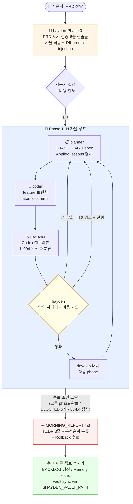

# 🌙 Hayden — 야간 자율 개발 오케스트레이터

> PRD를 던지고 자러 가면, 아침에 진척된 코드와 리포트가 기다리는 Claude Code 서브에이전트 세트

[](LICENSE)
[](https://docs.anthropic.com/claude/docs/claude-code)

---

## ✨ 핵심 아이디어

비개발자도, 또는 잠을 자는 사이에도, **PRD 한 장으로 phase 단위 개발이 굴러가도록** 만드는 오케스트레이터입니다.

- 🌅 **Phase 0 — 잠들기 전**: Hayden 이 PRD 를 읽고 리뷰 / 결정 항목 / 환경 점검 / 비용 한도 / 자율 적합도 / 보안 스캔까지 만들어줍니다
- 🌙 **Phase 1~N — 자는 동안**: Hayden 이 planner → coder → reviewer 를 호출하며 자율 루프 진행 (막힘 사다리 + 비용 트래커 + lessons 적용)
- ☀️ **아침**: `MORNING_REPORT.md` 의 **TL;DR 3 줄**로 출근 전 30 초 내 핵심 파악

---

## 🚦 시작 전에 — 본인 상황 선택

| 상황 | 권장 경로 | 예상 시간 |
|------|-----------|----------|
| 터미널 처음이에요 | → [`docs/install-for-beginners.md`](docs/install-for-beginners.md) | 25-40분 |
| Claude Code 는 써봤어요 | → 아래 "빠른 시작" 3 단계 | 5분 |
| 다 깔려있고 첫 실행만 알려주세요 | → "첫 실행" 섹션으로 점프 | 1분 |

---

## 🏗 구성

이 레포는 **4 개의 Claude Code 서브에이전트 + lessons 디렉토리 + config + scripts** 셋입니다.

| 파일 / 디렉토리 | 역할 |
|---|---|
| [`agents/hayden.md`](agents/hayden.md) | 야간 오케스트레이터 (200줄대 슬림 본체 + lessons/ 참조) |
| [`agents/planner.md`](agents/planner.md) | phase 기획 + phase DAG 작성 |
| [`agents/coder.md`](agents/coder.md) | superpowers 기반 구현 + atomic commit |
| [`agents/reviewer.md`](agents/reviewer.md) | Codex CLI 백그라운드 리뷰 + safety 재분류 |
| [`lessons/`](lessons/) | 과거 사이클 lesson 인덱스 (도메인 익명화, `applies_when` 메타) |
| [`config/llm-routing.yml`](config/llm-routing.yml) | LLM 모델 후보 + 단가 + `valid_until` |
| [`docs/COST_TRACKER.md`](docs/COST_TRACKER.md) | 사이클 비용 누적 템플릿 |
| [`scripts/check-prerequisites.sh`](scripts/check-prerequisites.sh) | 의존성 자동 점검 (4 단 분류 출력) |

전체 흐름:



---

## 🚀 빠른 시작

> 🌱 **비개발자라면 → [`docs/install-for-beginners.md`](docs/install-for-beginners.md) 부터 보세요.**
> 설치 끝났는지 헷갈리면 `bash scripts/check-prerequisites.sh` 한 줄로 자동 점검 가능.

### 1. 의존성 (4 단 분류 — 실제 동작 기준)

| 분류 | 도구 | 없으면? |
|---|---|---|
| 🔴 **절대 필수** | Claude Code CLI | 너 자신이 동작 불가 |
| 🟠 **사실상 필수** | Superpowers / Token Savior MCP | 자율 루프 품질 저하 (planner·coder·압축 정책 의존) |
| 🟡 **권장** | Codex CLI / pr-review-toolkit | self-review fallback. critical 영역은 BLOCKED |
| ⚪ **선택** | BMAD | 대규모 신규 제품 PRD 에만 |

- 🟠 의 Token Savior 는 README 에서 "강력 권장" 으로 표기했지만 **실제 동작 흐름상 사실상 필수**입니다 (컨텍스트 압축 정책 핵심).
- 🟡 의 Codex 가 없으면 reviewer 가 superpowers fallback 사용. 단 critical 영역(보안 / 인증 / DB / 결제) 변경은 BLOCKED 처리되니 critical 작업이 있는 PRD 에선 사실상 필요.

### 2. 설치 (4 단계)

```bash
# 1) 이 레포 clone
git clone https://github.com/qwert5046-commits/hayden-orchestrator.git
cd hayden-orchestrator

# 2) agents 4 개 파일을 Claude Code agents 디렉토리에 복사
#    글로벌 설치 (모든 프로젝트에서 사용):
cp agents/*.md ~/.claude/agents/

#    또는 프로젝트별 설치 (현재 프로젝트에서만):
mkdir -p .claude/agents
cp agents/*.md .claude/agents/

# 3) 사용자 프로젝트에 런타임 자산 scaffold (lessons/, config/, COST_TRACKER)
#    agents 본문이 이 자산들을 참조하므로 프로젝트마다 한 번 실행.
#    현재 디렉토리에 scaffold:
bash scripts/setup-project.sh
#    또는 다른 프로젝트 경로 지정:
bash scripts/setup-project.sh /path/to/my-project

# 4) 사전 점검 (4 단 분류로 출력)
bash scripts/check-prerequisites.sh
```

> **왜 자산을 따로 scaffold 해야 하나요?** agents 4 개는 글로벌 한 곳에 있어도 동작하지만, `lessons/` `config/llm-routing.yml` `docs/COST_TRACKER.md` 는 **사용자 프로젝트마다 사이클에 따라 진화**합니다 (BACKLOG / 비용 누적 / 신규 lesson 등). 그래서 글로벌이 아니라 사용자 프로젝트에 깔립니다.

### 3. 첫 실행

1. 프로젝트 폴더에 PRD 를 작성 — 파일명은 `docs/PRD.md` 또는 `docs/PRD_xxx.md` (자동 탐지)
2. (선택) Obsidian vault 사용 시 환경변수 설정:

   ```bash
   export HAYDEN_VAULT_PATH="/path/to/your/Obsidian/vault"
   ```

   미설정이면 vault sync 는 skip (오류 아님).

3. Claude Code 메인 세션에서:

   ```text
   hayden 에이전트를 활용해 프로젝트 시작하자. docs/ 안에 PRD 있어.
   ```

4. Hayden 이 Phase 0 를 실행하며 다음 6 개 산출물을 생성합니다:

   - `docs/PRD_REVIEW.md` — 리뷰 + 자율 적합도(X/10) + PII 스캔 + prompt injection 감지
   - `docs/DECISIONS.md` — 사용자 결정 체크리스트 (비용 한도 포함)
   - `docs/PREFLIGHT.md` — 환경변수 / 토큰 / 계정 (🔴 / 🟡 / 🟢)
   - `docs/ENVIRONMENT.md` — 환경 타입 판정 (`local-only` / `serverless` / `integration` / `mixed`)
   - `docs/WORK_LOG.md` — 작업 로그
   - `docs/COST_TRACKER.md` — 비용 트래커 (사이클 한도 + 누적)

5. DECISIONS.md 채우고 PREFLIGHT 🔴 항목 진행한 뒤 **"Phase 1 시작"** 또는 **"go"** 로 자율 루프 시작

자세한 설치·운영 가이드는 [`docs/installation.md`](docs/installation.md) 참고.

---

## 🎛 커스터마이즈 포인트

- **LLM 모델 후보 / 단가 / valid_until**: [`config/llm-routing.yml`](config/llm-routing.yml)
- **vault 경로**: `HAYDEN_VAULT_PATH` 환경변수
- **사용자 페르소나 / 언어**: `agents/hayden.md` 끝부분 "사용자와의 커뮤니케이션 톤"
- **막힘 사다리 임계값**: `agents/hayden.md` "막힘 사다리" 섹션
- **비용 한도 / 가드 발동 시점**: `docs/COST_TRACKER.md` 상단

자세한 가이드: [`docs/customization.md`](docs/customization.md)

---

## 🧠 설계 원칙

이 오케스트레이터가 따르는 6 가지 원칙:

1. **사용자가 자는 동안 깨우지 않는다** — 막힘 사다리 L1/L2 는 자동 우회. L3/L4 만 즉시 정지.
2. **자식 응답은 휘발된다** — 모든 산출물은 반드시 파일로
3. **컨텍스트는 적극적으로 비운다** — WORK_LOG 핸드오프 + Token Savior 영구 저장으로 자가 압축
4. **외부 LLM 리뷰는 더블체크** — Codex 1순위 + critical 영역은 superpowers 동시. 충돌 시 엄격한 쪽.
5. **사용자가 결정해야 할 건 절대 추측하지 않는다** — DECISIONS.md 큐만 남기고 우회
6. **lesson 은 retrievable knowledge** — agents/*.md 본문에 도메인 사례 박지 않고 `lessons/` 인덱스에서 `applies_when` 매칭만 끌어옴

자세한 흐름 설명: [`docs/workflow.md`](docs/workflow.md)

---

## 📂 레포 구조

```text
hayden-orchestrator/
├── README.md              ← 지금 이 파일
├── LICENSE                ← MIT
├── agents/                ← Claude Code agents 정의 4 개
│   ├── hayden.md          ← 오케스트레이터 (슬림)
│   ├── planner.md         ← 기획 + DAG
│   ├── coder.md           ← 구현
│   └── reviewer.md        ← 리뷰
├── lessons/               ← 도메인 익명화된 lesson 인덱스
│   ├── README.md          ← 인덱스 + 적용 원칙
│   └── L-001 ~ L-012.md   ← 개별 lesson (frontmatter applies_when)
├── config/
│   └── llm-routing.yml    ← LLM 모델 후보 + 단가 + valid_until
├── docs/
│   ├── installation.md
│   ├── install-for-beginners.md
│   ├── customization.md
│   ├── workflow.md
│   ├── lessons-learned.md ← (redirect → lessons/)
│   └── COST_TRACKER.md    ← 사이클별 비용 누적 템플릿
├── scripts/
│   └── check-prerequisites.sh   ← 의존성 자동 점검 (4 단 분류)
└── .gitignore
```

---

## 🤝 기여 / 피드백

- 버그 / 개선 제안: [Issues](https://github.com/qwert5046-commits/hayden-orchestrator/issues)
- 본인 환경에서 개선한 버전은 fork 후 PR 환영

---

## 📜 라이선스

[MIT License](LICENSE) — 자유롭게 사용·수정·재배포 가능. 책임은 사용자에게 있습니다.

---

## 🙏 영감 / 참고

- [Claude Code](https://docs.anthropic.com/claude/docs/claude-code) — 베이스 플랫폼
- [Superpowers](https://github.com/obra/superpowers) — TDD / debugging / planning 스킬 셋
- [BMAD Method](https://github.com/bmadcode/BMAD-METHOD) — 대규모 PRD 분해
- [Codex CLI](https://github.com/openai/codex) — 외부 LLM 코드 리뷰
- [Token Savior](https://github.com/) — MCP 기반 토큰 절약 + 세션 간 기억
